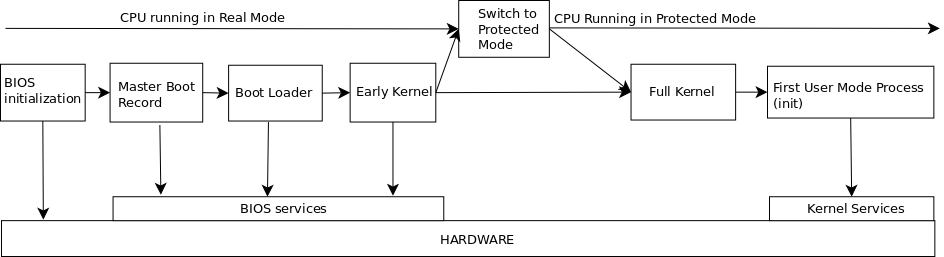

## 2. High level view of the boot process
What happens when you press the computer start button ? How is the kernel loaded into memory ?  
In order to understand what is happening we need to have a view of the boot process. This is the purpose of this section.  
Booting is a pretty complicated procedure, which we will analyze in more detail in the further sections.  
In this section we will try to understand what is happening from a higher level view.  
An high-level overview of the boot process is presented in the below picture:

When the start button is pressed, the motherboard is powered up and it tries to start the processor.  
In order to maintain compatibility with early 8086 processors, the processor starts in _real mode_.  
The 8086 processor has a 20-bit address bus and therefore it could address only 1MB of physical memory (from 0 to 0x100000).  
But the 8086 processor also has 16 bit registers, so the maximum physical address which can be kept in registers is 2^16 - 1 (0xffff, up to 64 kB).   
In order to be able to access the full 1MB address range, we need to use a memory addressing technique called _memory segmentation_.  
According to this technique, the memory is divided in segments of 64KB (fixed size).  
An address consists of two parts: a segment base address and an offset from the base address.  
In _real mode_, the base address of a segment is referrend by a segment selector and is computed as follows:  
_segmentBaseAddress = segmentSelector << 4_  

Therefore, the address can be computed as follows:  
_physicalAddress = segmentSelector << 4 + offset_  

At processor _reset_, the values of the IP register is set to 0xfff0. The value of the CS selector is set to 0xf000
Even if only 1MB is addresable at power-up, a hidden special base address equal to 0xffff0000 for CS (CS cache register) is applied causing the processor to try executing code from address _0xffff0000 + 0xfff0 = 0xfffffff0_ (which is 4G -16 bytes).  
This is sometimes referred at as the power-up hack.  
The address 0xfffffff0 is where the _reset vector_ resides. Here, there is a far jump to the _BIOS entry point_. After taking the jump, the hidden base address is cleared.  
Now, the processor starts executing the BIOS code. The BIOS code first perform some hardware initialization than starts the Power-On Self Test (POST), which tests some hardware components.  
After this, the BIOS wants to load and operating system (which can be on a hard-disk, DVD, stick, etc).  
Let us assume the the operating system is kept on a hard-disk. The BIOS reads the first sector (sector 0) of the hard-disk, known as the Master Boot Record (MBR).  
