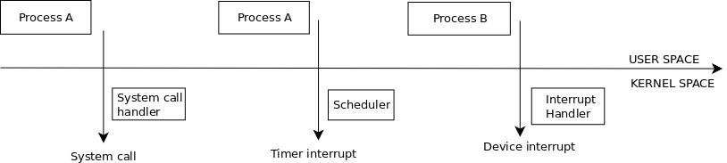
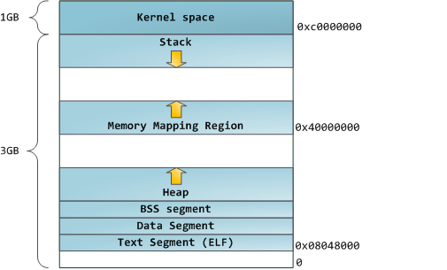

## 1. Introduction
### 1.1 About Linux
Linux is a Unix-like operating systems.  
Some important characteristics of the linux kernel are:  
- Is a monolitic kernel  
  So, the entire operating system is running in kernel space, in privileged mode.  
  By contrast, in a microkernel contains the minimum amount of software needed to implement in operating system (such as memory management, process management, IPC, etc).  
  The microkernel runs in privileged mode. Files systems, drivers, networking stack are tipically removed from the microkernel and run in user space.  
- Supports modules  
  Linux's support for modules is very good, being able to automactically load and unload modules on demand.  
- Have kernel threads  
  Linux have support for kernel threads.  
  It uses them, for example, to execute some kernel functions periodically, suck as flushing disk caches, swapping out unused memory pages, etc.  
  Kernel threads are executing exclusively in kernel space.  
- Provides multithreading support for applications.  
  There is no strong distinction between user threads and processes in the kernel.  
  Both are represented by the same abstraction (*task_struct*) and are scheduled similary by the scheduler.  
- Is a preemptive kernel  
  This means the execution paths in kernel mode can be interleaved at the scheduler decision.  
- Supports SMP (symmetric multi-processing) mode  
  In that case the kernel can use multiple processors and each processor can handle any kernel task.  
  All processors are viewed in the same way, the kernel makes no distinction between them.  
- Supports a wide range of hardware architectures, see [here](https://github.com/torvalds/linux/tree/master/arch)  

### 1.2 Kernel compilation
A new kernel can be downloaded from the official page: https://www.kernel.org/
For example, to compile kernel 4.5.1, perform the following steps:
- Create a new directory where to extract the kernel:  
  %> *mkdir ~/kernelbuild*  
  %> *cd ~/kernelbuild*  
- Download the kernel:  
  %> *wget https://cdn.kernel.org/pub/linux/kernel/v4.x/linux-4.5.1.tar.xz*  
- Extract the kernel:  
  %> *tar -xaf linux-4.5.1.tar.xz*  
  %> *cd linux-4.5.1*  
- Ensure that the kernel tree is clean:  
  %> *make clean & make mrproper*  
- Next, we need to _configure_ the kernel.  
  For this, we can optionally copy the config file of an existing, working kernel:  
  %> *cp /boot/config-`uname -r` .config*  
  In this case, we need to update the copied config:  
  %> *make localmodconfig*  
  After this, we can further tune config options by using one of:  
  %> *make menuconfig* (for a legacy command-line ncurses interface).  
  %> *make nconfig* (newer ncurses based interface).  
  %> *make xconfig* (user friendly Qt based interface).  
- Now, is time to compile the kernel:  
  %> *make -jn* (where **n** is the number of CPUs on your system)  
- Compile and install the kernel modules:  
  %> *sudo make modules_install*  
  This will compile and intall the kernel modules into /lib/modules/<kernel version>
- Install the kernel:  
  %> *sudo make install*  
  This will install your new kernel into /build.  
  It will also upgrade the GRUB 2 bootloader configuration file, so, next time we will start the system we can select our new kernel.  

To remove a compiled kernel, you can perform the following steps:  
- Remove all the files related to that kernel from /build  
- Upgrade the GRUB 2 configuration by running the command:  
  %> *sudo update-grub*  
  This will remove the kernel entry from GRUB 2's configuration file.  

### 1.3 Basic operating system concepts
The main purpose of an operating system is to provide an environment in which the use application can run.  
The operating system abstract the hardware resources and hide some low level details regarding computer hardware organization from the user applications.  
In order for the operating system to provide such and abstraction, it must interact directly with the hardware.  
The kernel is the lowest level part of an operating systems. We can see the kernel as the heart of the operating system.  
The kernel is loaded into memory by a _bootloader_. There are several bootloaders available. On x86/x86_64 systems, a popular choice is _GNU GRUB 2_.  
When an application needs to use a hardware resource, it must issue a request to the kernel, which will interact with that resource in the application behalf.  
Modern operating systems also provide a level of _protection_ to the application programs. For example, an application cannot access directly the physical memory or the memory reserved for the operating system itself.  
In order to achieve this, modern hardware provides at least two different _execution modes_ for the CPU: a non-privileged mode for user programs (called _User Mode_) and a privileged mode for the operating sytem kernel (called _Kernel Mode_).  

#### 1.3.1 Processes
A fundamental abstraction of an operating system is the _process_. A process is the execution context of a running program.  
Each process has its own _address space_: the set of addresses that the process can reference.  
Several processes can be active concurrently and contend for the system resources (such as CPU).  
On _uniprocessor_ system, only one process can use the CPU at a certain moment, so only one execution flow can progress at a time.  
But many modern hardware architectures are multiprocessor architectures and, in that case, the kernel must use the hardware efficiently and allow multiple processes executing at the same time (a maximum number equal to the processor cores).  
An operating system component called the _scheduler_ chooses which process gets executed at a certain time.  
Linux is a __preemptable__ operating systems, meaning that the operating systems tracks how long a process can hold a CPU and periodically activates the scheduler which decides when the process needs to relinquish the CPU.  
A process does not need to know about the existance of another process. From the process point a view, it is like is the only process on the machine and it has exclusive access to the resources abstracted by the operating system.  
Of course, this is only an illusion, but it has the big merrit of greatly simplifying programming of the user applications.  

We have seen that, when using Linux, a CPU can run in either Kernel Mode (privileged mode) or User Mode (non-privileged mode).  
Some CPUs (such a x86 CPUs) can have more than two execution modes. For example, x86 CPUs have four execution modes call rings (ring 0 to ring 3).  
But, even in this case, Linux uses only two execution modes: Kernel Mode and User Mode.  
We have also seen that each time a process needs to have access to the kernel services and needs to make a request to the kernel.  
This happens by using _system calls_.  
Each system call sets up some parameters to identify the request and execute a hardware dependent CPU instruction to switch the CPU execution mode from User Mode to Kernel Mode.  
Similary, a CPU instruction is used to return from the Kernel Space to User Space.   
So, during the lifetime of an user process, it can execute both in user space and in kernel space.  
For example, here are some examples in which the execution can switch from User Mode to Kernel Mode:  
- The process issues a system call (for example because it wants to read from a file). This effectively switches the execution from User Mode to Kernel Mode.  
  The system call will be handled, in Kernel Mode, by a  _system call handler_. The system call handler executes the system call than returns to User Space.  
- A timer interrupt activates the kernel scheduler. The scheduler code executes in Kernel Space.  
- A hardware device _raises an interrupt_ (for example because in I/O operation has finished). The execution switches to Kernel Mode and the _interrupt handler_ gets executed.  
- The CPU executing the process instructions _signals an exception_ (for example, because an invalid instruction was attempted to be executed).  
  The execution switches to Kernel Mode and the exception handler is called.  
- A kernel thread is executed. Kernel threads are executed exclusively in Kernel Space.  

Here is an example showing how processes switches between User Space and Kernel Space:  

In this example:
- Process A switches execution from User Space to Kernel Space via a system call.  
- The system call gets executed in Kernel Space, than the execution switches back to User Space.  
- At some point, the scheduler gets activated via a timer interrupt, the execution switching again to Kernel Mode.  
- The scheduler decides to stop the execution of process A and to start the execution of process B.  
- The process B continues its execution in User Space until a hardware device raises an interrupt.
  At that point, the execution switches to Kernel Mode in order for the interrupt handler to be executed.  

As we have seen, the scheduler might decide that is time to stop the execution of a process and to start or continue the execution of another one.  
The kernel associates a _process descriptor_ to each process. The process descriptor is used to keep context information about the current state of the process.  
When the kernel stops the execution of a process, it saves the content of several processor registers in the process descriptor, such as:
- the instruction pointer (IP, aka program counter) and stack pointer (SP) registers
- the general purpose registers
- the floating point unit (FPU) registers
- the process control registers (Processor Status Word), which contains information about the processor state
- the memory management registers

When the kernel decides to continue the execution of a process, it uses the processor descriptor to load the CPU registers.  
This way, the process context is restored and the execution resumes from where it stopped (because the IP registers contains the address of the instruction to be executed next).  

We have seen that each process gets its own address space: the memory addresses that the process is allowed to refer.  
Those memory addresses are _virtual memory_ addresses.  
_Virtual memory is an abstraction_. It brings many advantages:  
- Virtual memory abstraction makes easier to isolate the processes address spaces.   
- It is possible to run applications whose memory needs is larger than the available physical memory.
- Processes can execute a program whose code is only partial loaded in memory.   
- Processes can share s single memory image of a library.
- Programs can be relocatable (they can be placed anywhere in the physical memory).

It is obvious that virtual addresses eventually need to be translated to physical addresses. This is the job of MMU (_Memory Management Unit_), which is programmed by the kernel.  
The represents the virtual address space of a process as a list of _memory area descriptors_.  
When a process is created, the kernel assignes a virtual address space to the process, containing memory areas for:
- The executable code of the program  
- The initialized data of the program
- The uninitialized data of the program
- The initial stack (the process User Mode stack)
- The executable code and data for the shared libraries needed by the program  
- The heap

The memory layout of a process, on the x86 architecture is:

In Linux, an executable follows the ELF (Executable and Linkable Format). From the execution point of view, the ELF file composed by _segments_: 
- The _text_ segment contains the executable instructions
- The _data_ segment contains the initialized data
- The _BSS_ segment contains unititialized data
- The heap area contains the memory area from which to dynamically allocate memory
- The memory mapping area keeps the data memory mapped in the process address space
- The stack area keeps the process User Mode stack
